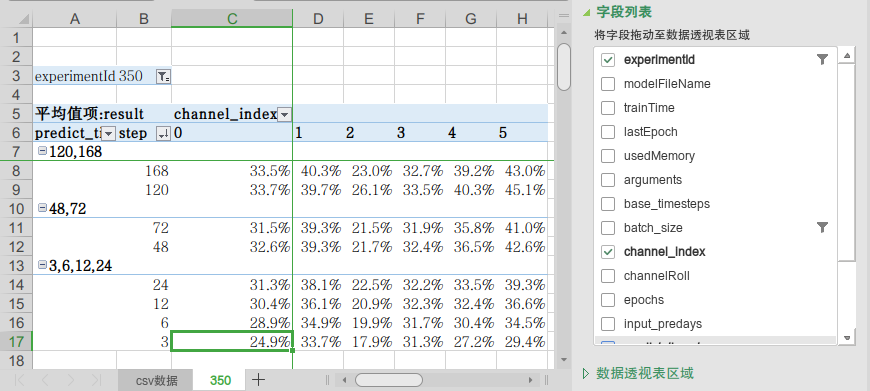

目录
- [简介](#简介)
- [运行环境](#运行环境)
  - [PC](#pc)
  - [GPU](#gpu)
  - [python](#python)
  - [python第三方库](#python第三方库)
  - [开发调试](#开发调试)
- [阶段一：准备数据](#阶段一准备数据)
  - [数据目录结构](#数据目录结构)
  - [读取**本地**空气质量历史数据](#读取本地空气质量历史数据)
  - [预处理空气质量历史数据](#预处理空气质量历史数据)
  - [检视空气质量历史数据](#检视空气质量历史数据)
  - [下载天气预报历史数据](#下载天气预报历史数据)
  - [预处理天气预报历史数据](#预处理天气预报历史数据)
  - [准备工作日历史数据](#准备工作日历史数据)
- [阶段二：训练模型](#阶段二训练模型)
  - [训练参数](#训练参数)
  - [训练模型](#训练模型)
  - [最佳参数](#最佳参数)
- [阶段三：测试评估](#阶段三测试评估)
  - [评估标准](#评估标准)
  - [对比模型](#对比模型)
  - [测试](#测试)
- [阶段四：常规化运行](#阶段四常规化运行)
- [Datasets](#datasets)
  - [天气预报历史数据](#天气预报历史数据)
  - [天气预报实时数据](#天气预报实时数据)
  - [中国节假日](#中国节假日)
- [Citation](#citation)
- [Acknowledgements](#acknowledgements)

# 简介
* MingNet 是用于制作环保类AI模型的工具

| 工具  | 描述  |
|---|---|
| AirNet  | 空气质量数据的预测模型工具  |
| DataPrepare|数据的预处理的程序 |
| DataSource|数据采集的程序 |
* AirNet模型与其他预测模型的比较：

||训练耗时|训练硬件需求|常规运行耗时|常规运行硬件需求|源数据需求|
|---|---|---|---|---|---|
|AirNet6|2天|3080GPU|2分钟|普通PC|历史数据、天气预测|
|化学模型|无|无|6小时|服务器集群|历史数据、天气预测、**源清单**|
|LSTM|1天|3080GPU|1分钟|普通PC|历史数据|
|Prophet|无|无|12小时|普通PC|历史数据|

* 本工具只是生成模型的工具，**不包含**模型和数据（原始数据及权重数据）。
* 下载代码后请按照“数据准备-训练测试-常规运行”步骤使用本工具基于本地数据训练和使用模型。
# 运行环境
## PC
* 1~n 台（训练时建议n台并行，常规运行时只需1台）
* 内存：48GB 或以上
* 存储：10TB 或以上，多台PC时需通过Samba或NFS实现多机共享存储
* 操作系统：建议使用 ubuntu server 20.04 或以上版本

## GPU    
* 训练模型时因计算量巨大，本工具模型基于[pytorch](https://pytorch.org/)框架，支持硬件加速，建议使用nVidia 3080或更高规格的GPU
* 常规运行时对算力要求不高，只需要1台装有nVidia 970级别的GPU的PC
* GPU驱动程序，建议安装470版本（驱动版本并非越高越好），linux下[安装教程](https://www.myfreax.com/how-to-nvidia-drivers-on-ubuntu-20-04/)   
* 安装后重启PC，之后可以在终端使用以下指令测试安装是否成功。
```bash
nvidia-smi
```   
* 若显示GPU正确的驱动版本及cuda版本，则表示成功
* 若失败，可尝试更新linux头文件，重启后再尝试：  
```bash
sudo apt-get install linux-headers-$(uname -r)
```

## python
* 需使用 python 3.9 或以上版本，建议使用[Anaconda](https://www.anaconda.com/)管理python环境。[安装教程](https://cloud.tencent.com/developer/article/1649008)
* 安装后建立独立的环境（例如air）。[conda使用教程](https://cloud.tencent.com/developer/article/2125510)
```bash
conda create -n air python=3.9
```
* 本文后续的命令行均基于air运行环境，请在执行命令前，先进入air环境
```bash
conda activate air
```

## python第三方库
* 工具使用众多的第三方库，可使用以下指令安装：
```bash
pip3 install -r requirements.txt
```
* 有些库如果用pip3安装不成功，可以尝试用conda安装，如
```bash
conda install -c conda-forge pydap
```

## 开发调试
* 本工具使用开源的[Visual Studio Code](https://code.visualstudio.com/)开发，并针对“数据准备-训练测试-常规运行”三个阶段设置了三个运行环境配置，详细参数可参考 .vscode/launch.json 文件。
* 在vscode中运行调试前，需设置选择python使用air环境，[教程](https://www.cnblogs.com/macroxu-1982/p/16284960.html)
# 阶段一：准备数据
## 数据目录结构
* 数据目录切记**不能**与代码放在一起，应单独存放，建议放在稳定可靠的、多台计算PC共享的目录中，这里假设数据根目录为“/datapool/shared”
* 建子目录：
```bash
cd /datapool/shared
mkdir -p AirNet vs ucar production vs/lstm vs/prophet vs/yesterday
```

## 读取**本地**空气质量历史数据
* AirNet模型是基于本地数据（监测点位、历史上的监测数据及气象数据等）训练得来，其他地方的模型不能适应于本地使用。
* 本地的空气质量历史数据（点位的小时值）数据源请咨询本地数据管理机构。
* 作为**例子**，以下方法用随机和正弦数填充空气质量历史数据，帮助了解可供训练的数据集结构。但这一步**必须**用本地区真实空气质量历史数据代替，可参考DataPrepare/mon/db_reader.py编写自己的代码，读取本地空气质量数据库，生成历史数据文件。
  * 调试运行：在vscode的调试选Prepare_Data设置，运行 DataPrepare/mon/db_reader.py 文件
  * 直接运行：
```bash
python3 DataPrepare/mon/db_reader.py --data_dir /datapool/shared/AirNet --gfs_root_dir /datapool/shared/ucar --epa_dir /datapool/shared/epa --dm_ps_dir /datapool/shared/dm_ps --vs_dir /datapool/shared/vs --production_dir /datapool/shared/production --source_type guoKong --weather_source gfs_sx --start 2021-01-01 --end 2022-11-11 --test_date 2022-07-01
```
* 完成后会在 /datapool/shared/AirNet 生成以下文件：

|  文件名   | 描述  |
|  ----  | ----  |
| guoKong_meta_points.csv  | 监测点位的元数据 |
| guoKong_meta_times.csv  | 时间点的元数据，每个时间点是一小时，由开始时间（--start）至结束时间（--end），遵循“始含终不含”的python range的习惯|
| guoKong_meta_channels.csv  | 监测因子的元数据 |
| guoKong_src_c(0~5).npy  | 每个监测因子一个历史数据文件。最后的编号为监测因子在元数据文件guoKong_meta_channels.csv中的顺序（从0开始）。<br/>文件是numpy的多维数据文件格式，维度[T,V,C]，其中第一维度T为时间点，对应guoKong_meta_times.csv的时间点；第二维度V为点位，对应guoKong_meta_points.csv的点位；第三维度C为监测因子，只有一个（因不同监测因子已经拆开文件）；|


## 预处理空气质量历史数据

* 由于空气质量监测由在线监测设备生成，日常存在缺数据的现象，而模型不能输入空数据，所以需要先把缺失的数据补足。补足的方法是先用空间补足，即使用同一时间周边有数据的点位的数据，通过空间插值的方法得出缺数据点位的数值。如果空间补足后仍有缺数据（这种情况一般为网络或者中心服务故障，导致同一时间所有点位都没有数据），则使用时间补足。时间补足的规则非常简单，就是用这个点位前一天的数据补足缺失的数据。
* 对于所有的输入数据，在进入模型之前，规格化都是必须的，规格化就是把所有数值按比例压缩到[0,1]的范围，以适用于神经网络运算。
* 规格化的上下限值一般设置为样本数据（供训练的历史数据）的最大最小值，但AirNet这里使用《环境空气质量指数(AQI)技术规定》HJ633-2012 ）中“4.1空气质量分指数分级方案”中各因子的最大标准值为规格化的最大值。

* 以下方法对源数据作预处理，生成规格化后的数据
  * 调试运行：在vscode的调试选Prepare_Data设置，运行 DataPrepare/pretreat.py 文件
  * 直接运行：
```bash
python3 DataPrepare/pretreat.py --data_dir /datapool/shared/AirNet --gfs_root_dir /datapool/shared/ucar --epa_dir /datapool/shared/epa --dm_ps_dir /datapool/shared/dm_ps --vs_dir /datapool/shared/vs --production_dir /datapool/shared/production --source_type guoKong --weather_source gfs_sx --start 2021-01-01 --end 2022-11-11 --test_date 2022-07-01 
```
* 完成后会在 /datapool/shared/AirNet 生成以下文件：

|  文件名   | 描述  |
|  ----  | ----  |
| guoKong_spatial_traeted_c(0~5).npy  | 每个监测因子一个空间插值后的数据文件。文件的数据结构与src文件一致|
| guoKong_time_traeted_c(0~5).npy  | 每个监测因子一个时间插值后的数据文件。文件的数据结构与src文件一致|
| guoKong_normalized_c(0~5).npy  | 每个监测因子一个规格化后的数据文件。文件的数据结构与src文件一致|

## 检视空气质量历史数据
* 由于历史数据量大，通过**可视化**方式检视，找出其中的问题是排错的有效手段。
* 以下方法将源数据及规格化后数据作伪彩图（pcolormesh）和点图：
  * 调试运行：在vscode的调试选Prepare_Data设置，运行 DataPrepare/ploter.py 文件
  * 直接运行：
```bash
python3 DataPrepare/ploter.py --data_dir /datapool/shared/AirNet --gfs_root_dir /datapool/shared/ucar --epa_dir /datapool/shared/epa --dm_ps_dir /datapool/shared/dm_ps --vs_dir /datapool/shared/vs --production_dir /datapool/shared/production --source_type guoKong --weather_source gfs_sx --start 2021-01-01 --end 2022-11-11 --test_date 2022-07-01 
``` 
* 完成后会在 /datapool/shared/AirNet/plot 生成以下文件：

|  文件名   | 描述  |
|  ----  | ----  |
| guoKong_points.png | 根据监测点位元数据guoKong_meta_points.csv生成的地图，可检查点位坐标是否正确|
| guoKong_missing_src_c(0~5).png  | 根据每个监测因子的源数据是否存在生成的伪彩图，可检查数据**缺失**的情况。<br/>x坐标为日期，y坐标为点位，图中的每个点表示某点位在某天有多少个源数据，最多有24个（24小时都有数），最少0个|
| guoKong_error_src_c(0~5).png  | 根据每个监测因子的源数据的数值生成的伪彩图，可检查源数据的**合理性**。<br/>x坐标为日期，y坐标为点位，图中的每个点表示某点位在某天的源数据的平均值|
| guoKong_missing_normalized_c(0~5).png  | 根据每个监测因子的规格化后数据是否存在生成的伪彩图，可检查补足后的数据的**缺失**情况。<br/>x坐标为日期，y坐标为点位，图中的每个点表示某点位在某天有多少个规格化后数据数据，因为数据已经过补足，**应该**有24个|
| guoKong_error_normalized_c(0~5).png  | 根据每个监测因子的规格化后数据的数值生成的伪彩图，可检查规格化后数据的**合理性**。<br/>x坐标为日期，y坐标为点位，图中的每个点表示某点位在某天的规格化后数据的平均值|

## 下载天气预报历史数据
* 本工具（子目录DataSource/noaa/）可以下载[NOAA](https://www.noaa.gov/)的GFS0.25天气预测数据，范围和因子等可通过定义文件设置（如广东省"north": 26,"west": 109,"south": 20,"east": 118，定义文件为代码库中的 DataSource/noaa/rda_tds_gfs_xx.json文件，也可根据实际情况范围创建本地的定义文件）。
* GFS数据有两个来源，其中，用于常规运行的实时GFS天气预测数据可从NOMADS（NOAA Operational Model Archive and Distribution System）服务获取；但由于该网站上只保留最近8天数据，若想获取历史的天气预测数据用于训练（一般需要两年），需要从[UCAR](https://www.ucar.edu/)（University Corporation for Atmospheric Research）获取（不过......UCAR很......慢）。这两个渠道使用的数据接口均为 [OPeNDAP](https://www.opendap.org/)。
* 下面的命令例子将陕西的2021年和2022年的天气预报数据下载到目录 /datapool/shared/ucar/gfs_sx/rda_slice
  * 由于历史数据量巨大，下载时间漫长（约需1周，并且多路下载会被ban IP），建议使用screen指令新开一个屏幕会话：
```bash
mkdir -p /datapool/shared/ucar/gfs_sx/rda_slice
screen -S air
cd DataSource/noaa
python3 rda_dap.py --action download --start 2021-01-01 --end 2023-01-01 --weather_source gfs_sx --gfs_root_dir /datapool/shared/ucar --config_file rda_tds_gfs_sx.json
```
* 下载完成后，会在 /datapool/shared/ucar/gfs_sx/rda_slice 生成数据文件，每天的数据放一个文件。文件是numpy多维数据，维度为[D,H,lon,lat,C]，其中第一维D是天，第二维H是预测小时，第三维和第四维是经度和纬度，第五维是8个因子（气压、光照、降水、温度、湿度、u风速、v风速、陆地）。
* 由于ucar在外网，传输较慢，下载两年的历史数据阅需时约一周，部分**已下载好**的数据可从网盘获取：
https://cloud.189.cn/web/share?code=juIZNneUjeAf  （访问码：9gm7），下载后可以用下面的命令解压：
```bash
cd /datapool/shared/ucar/gfs_sx
tar -xzvf <path of file>/gfs_sx_2021-2022.tgz
```
## 预处理天气预报历史数据
* 由于空气质量数据是基于监测点位的数据，而天气预测数据是网格数据，为了可以将这两种数据融入到一个模型中，需要把他们的空间域统一,使用监测点位作为统一的空间域，每个监测点位的天气预测数据，根据其位置通过插值得出。
* 下载的气象数据也需要补足，补足后也会进行规格化处理。规格化的上下限值一般设置为样本数据（供训练的历史数据）的最大最小值，但为了训练出的模型能够适应样本以外的数据，这里，将上下限值扩展一倍。 设S<sub>max</sub>、S<sub>min</sub>、S<sub>avg</sub>分别是所有样本数据的最大值、最小值和平均值，规格化的上限和下限使用以下公式：  
Normalized<sub>max</sub>=2×S<sub>max</sub>-S<sub>avg</sub>  
Normalized<sub>min</sub>=2×S<sub>min</sub>-S<sub>avg</sub>
* 下面的命令可以预处理天气预报历史数据：
  * 调试运行：在vscode的调试选Prepare_Data设置，运行 DataSource/noaa/gfs2point.py 文件
  * 直接运行：
```bash
python3 DataSource/noaa/gfs2point.py  --data_dir /datapool/shared/AirNet --gfs_root_dir /datapool/shared/ucar --epa_dir /datapool/shared/epa --dm_ps_dir /datapool/shared/dm_ps --vs_dir /datapool/shared/vs --production_dir /datapool/shared/production --source_type guoKong --weather_source gfs_sx --start 2021-01-01 --end 2022-11-11 --test_date 2022-07-01
```
* 完成后会在 /datapool/shared/AirNet 生成以下文件：

|  文件名   | 描述  |
|  ----  | ----  |
| gfs_sx_meta_points.csv | 天气预报数据的点位的元数据（注：预处理后的天气预报数据已经是基于监测点位，而非经纬度网格）
| gfs_sx_meta_times.csv | 天气预报数据的时间点的元数据
| gfs_sx_meta_channels.csv | 天气预报数据的因子的元数据
| gfs_sx_time_treated_c0.npy | 天气预报数据的经时间补足处理后的数据，文件是numpy多维数据，[D,H,V,C]，其中第一维D是天，第二维H是预测小时，第三维是点位，第四维是8个因子（注意：因为天气数据在所有点位都有，所以不需要针对每种因子分文件，一个文件放了所有因子的数据）。
| gfs_sx_normalized_c0.npy | 天气预报数据的经规格化处理后的数据，文件格式与 gfs_sx_time_treated_c0.npy 的一样
| gfs_sx_newestWeatherData.npy | 只保留最新的天气预报数据的文件，即新的预测数据会覆盖原有的数据，文件是numpy多维数据，[T,V,C]，其中第一维T是时间点，第二维是点位，第三维是8个因子<br/>（后续的训练和测试，使用这个文件的数据，不用gfs_sx_normalized_c0.npy）
| gfs_sx_newestWeatherTime.csv | 只保留最新的天气预报数据的时间点元数据

* 并且会在 /datapool/shared/AirNet/plot 生成以下检视文件： 

|  文件名   | 描述  |
|  ----  | ----  |
| gfs_sx_newest_missing.png  | 根据每个监测因子的源数据是否存在生成的伪彩图，可检查数据**缺失**的情况。<br/>x坐标为日期，y坐标为点位，图中的每个点表示某点位在某天有多少个源数据，最多有192个（24小时*8因子），最少0个|
| gfs_sx_newest_error_c(0~7).png  | 根据每个天气因子的源数据的数值生成的伪彩图，可检查源数据的**合理性**。<br/>x坐标为日期，y坐标为点位，图中的每个点表示某点位在某天的源数据的平均值|


## 准备工作日历史数据  
* 本工具使用统计的经验值作为**社会活动量**的可以预测的指标。由于社会活动的频繁程度与“工作日（w）”及“休息日（r）”的交替密切相关，通过对“昨天-当天-明天”不同情况的枚举，得出www、wwr、wrw、wrr、rww、rwr、rrw、rrr这8种排列，通过对历史数据这8种情况的监测数据统计，就可以得出当天24小时的经验值。
* 下面的命令可以生成工作日历史数据：
  * 调试运行：在vscode的调试选Prepare_Data设置，运行 DataSource/economy/worktime.py 文件
  * 直接运行：
```bash
python3 DataSource/economy/worktime.py  --data_dir /datapool/shared/AirNet --gfs_root_dir /datapool/shared/ucar --epa_dir /datapool/shared/epa --dm_ps_dir /datapool/shared/dm_ps --vs_dir /datapool/shared/vs --production_dir /datapool/shared/production --source_type guoKong --weather_source gfs_sx --start 2021-01-01 --end 2022-11-11 --test_date 2022-07-01
```
完成后会在 /datapool/shared/AirNet 生成以下文件：

|  文件名   | 描述  |
|  ----  | ----  |
| guoKong_newest_worktime.pny | 工作日数据，文件是numpy多维数据，[T,V,C]，其中第一维T是时间点，第二维是点位，第三维是因子。
| guoKong_newest_worktime.png | 工作日数据的检视文件，图形是根据工作日数据的数值做的LineChart。

# 阶段二：训练模型
## 训练参数
* 使用不同的参数训练会生成不同的模型
* 每次训练模型，都会算出NME（Normalized Mean Errors）来评判模型的准确度，NME越小代表预测出来的数据更接近实测值，可选择NME较小的模型用于测试和常规化运行。
* 主要参数：

参数名|解释
---|---
c_index|指定监测因子（0~5：臭氧、二氧化氮、一氧化碳、二氧化硫、PM10、PM2.5）的序号
predict_timesteps|预测的多时间点输出，用逗号隔开
batch_size|输入批量中的样本数（越大训练速度略快，但需要更多显存）
model_layers|模型中的时空卷积层，每层的输出维度数，用逗号隔开
input_predays|输入的预测数据（天气和工作日）向前移位的天数
base_timesteps|输入时间点数
channel_roll|因子维度移位数

## 训练模型
* 命令行(一次训练3*6=18个模型,可把任务分开给不同机器并行运算)
```bash
./bat_train_all(_xx).sh
```
* 每训练出一个模型，会在 /datapool/shared/AirNet/sx_model_350 目录生成一个pytorch的模型参数文件如：airnet6_guoKong_ml32,64,128_b24_p7_ps120,168_bat12_c0_r0_20230228_125724.pt
* 另外，每次训练模型的参数及误差值（NME）也会记录在 /datapool/shared/AirNet/trained_models/trainResult.csv 文件中，便于分析训练的结果（可在同目录新建一个excel文件，链接trainResult.csv，然后在excel文件中使用透视表来分析结果数据）。

## 最佳参数
* 参数有许多种不同组合，不同参数训练出来的模型的准确率会有差异。
* 合适的参数需保持到 /datapool/shared/AirNet/guoKong_best_param.xlsx 文件中，在测试和常规化运行时需指定 param_group_id 来获取参数
* 上面bat_train_all.sh共训练18个模型，每个因子用3个模型实现172小时数据的预测，使用了在#350实验中，挑选出的适用与当地的最佳参数：
<details><summary>展开/收起</summary>

param_group_id|c_index|predict_timesteps|batch_size|model_layers|input_predays|base_timesteps|channel_roll
---|---|---|---|---|---|---|---
350|0|120,168|24|32,64,128|7|48|0
350|0|48,72|24|32,64,128|3|24|2
350|0|3,6,12,24|24|32,64,128|1|24|6
350|1|120,168|24|32,64,128|7|48|7
350|1|48,72|24|32,64,128|3|24|5
350|1|3,6,12,24|24|32,64,128|1|24|3
350|2|120,168|24|32,64,128|7|24|0
350|2|48,72|24|32,64,128|3|24|7
350|2|3,6,12,24|24|32,64,128|1|24|5
350|3|120,168|24|32,64,128|7|24|8
350|3|48,72|24|32,64,128|3|24|7
350|3|3,6,12,24|24|32,64,128|1|24|3
350|4|120,168|24|32,64,128|7|48|7
350|4|48,72|24|32,64,128|3|24|8
350|4|3,6,12,24|24|32,64,128|1|24|1
350|5|120,168|24|32,64,128|7|48|3
350|5|48,72|24|32,64,128|3|24|0
350|5|3,6,12,24|24|32,64,128|1|24|8
</details>

* 想要得出适用于本地、预测准确率高的模型，可经实验变化参数各种取值进行训练，根据误差值（NME）选取其中最好的模型，用于往后的常规化运行。下面的脚本会循环遍历所有参数组合，训练出 6 * 9 * 6=324个模型，并将参数及NME保存在 trainResult.csv 中，可通过数据透视表分析 trainResult.csv 中的数据找到最佳参数。（注：此方法耗时较多，建议修改脚本，分开给多台机器并行）
```bash
./bat_find_best.sh
```

# 阶段三：测试评估
## 评估标准
[《环境空气质量数值预报技术规范（HJ 1130-2020）》](https://www.mee.gov.cn/ywgz/fgbz/bz/bzwb/jcffbz/202005/t20200518_779714.shtml)

## 对比模型
* DataSource/vs 目录中有几个用于对比的预测模型：

文件名|简介
---|---
lstm_tester.py|LSTM时序模型（使用前需训练）
prophet_tester|prophet时序模型
yesterday_tester|“和昨天一样”模型，用昨天数据**一成不变**地作为今后7天的预测数据
* lstm 测试前，需要先训练，请在vscode的调试选Air设置，运行 DataSource/vs/lstm_tester.py 文件
* 其他需要对比模型也可以参考上面的代码例子，读取模型结果数据生成对比数据。

## 测试
* AirNet6/test_model.py 中的 all_days_test函数可运行多个模型作预测，并根据标准计算AQI值进行对比。
  * 调试运行：在vscode的调试选Air设置，运行 AirNet6/test_model.py 文件
  * 直接运行：
```bash
python3 AirNet6/test_model.py  --data_dir /datapool/shared/AirNet --gfs_root_dir /datapool/shared/ucar --epa_dir /datapool/shared/epa --dm_ps_dir /datapool/shared/dm_ps --vs_dir /datapool/shared/vs --production_dir /datapool/shared/production --source_type guoKong --weather_source gfs_sx --start 2021-01-01 --end 2022-11-11 --test_date 2022-07-01 --param_groud_id 350
```
* all_days_test函数运行后，会在 /datapool/shared/vs 目录生成以下文件：

文件名|简介
---|---
guoKong_2022_07_单项污染物浓度预报统计评估.csv|各个模型单向污染物的预测值及及与实测数据相比得出的偏差、误差、相关系数等评估数据
guoKong_2022_07_空气质量指数预报评估.csv|各个模型污染浓度预测值计算出的AQI和实测数据计算出的AQI及等级相比的准确度评估数据
guoKong_2022_07_AQI数据集.csv|各个模型污染浓度预测值计算出的AQI值

* 读取这些csv数据时，可在同一目录新建excel文件，链接csv文件，然后在excel文件中使用透视表来展示结果数据：


# 阶段四：常规化运行
* 本工具在常规运行的各个环节均有production.py程序用于任务实现，并配有相关的bash script（fill_missing.sh，主要用于启动运行环境）调用这些程序，可使用linux的定时执行功能执行这些script，实现常规化的自动运行。
* 在命令行输入：
```bash
crontab -e
```
编辑时程表，加入以下几行（加入时，需**替换**\<home dir>、\<code dir>）:
```bash
# 每星期更新一次中国放假日，用于生成worktime
2 2 * * 2 <home dir>/anaconda3/envs/air/bin/pip install -U chinesecalendar
# 更新天气预报数据
2 * * * * <code dir>/DataSource/noaa/fill_missing.sh
# 更新历史数据后，马上做预测
35 * * * * <code dir>/DataSource/gd/fill_missing.sh&&<code dir>/AirNet6/fill_missing.sh
```
* 第一个时程主要是每周更新中国假日数据，依赖于[chinesecalendar](https://pypi.org/project/chinesecalendar/)模块的更新
* 第二个时程在每个小时的第2分，从[NOAA](https://nomads.ncep.noaa.gov/dods/gfs_0p25_1hr)获取一次最新的天气预报数据。
* 第三个时程在每个小时的第35分，从本地更新实测数据，并马上做预测。之所以选第35分，是因为一般实测数据在第30分会更新完毕，使用时可根据本地情况更改时间。
* 每小时的时程完成后，会在 /datapool/shared/production/upload/guoKong 目录中，生成两个数据文件：

文件名|简介
---|---
guoKong_yyyymmdd_hh.csv|未来168小时的浓度预测值
stat_yyyymmdd_hh.csv|未来168小时的预测AQI统计值

* 可将这两个数据文件传输至数据中心入库，用于后续的展示和研判工作。

# Datasets
## 天气预报历史数据
* https://rda.ucar.edu/datasets/ds084.1/
  
```National Centers for Environmental Prediction/National Weather Service/NOAA/U.S. Department of Commerce. 2015, updated daily. NCEP GFS 0.25 Degree Global Forecast Grids Historical Archive. Research Data Archive at the National Center for Atmospheric Research, Computational and Information Systems Laboratory. https://doi.org/10.5065/D65D8PWK. Accessed 2023/02/08```

## 天气预报实时数据
* https://nomads.ncep.noaa.gov/dods/gfs_0p25_1hr

## 中国节假日
* https://github.com/LKI/chinese-calendar


# Citation


# Acknowledgements
* https://arxiv.org/abs/1709.04875
* https://github.com/tstanczyk95/WeatherGCNet
* https://github.com/ivivan/MTCN

